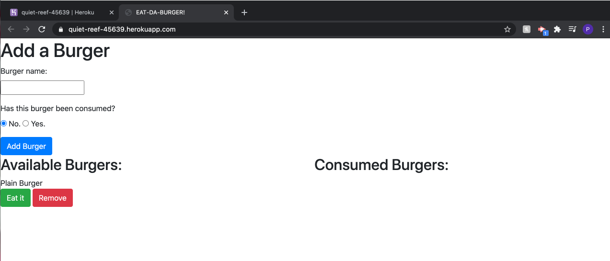

# burgers

## Description 

This project is a app that will help the user build a database of burgers, and keep track of whether or not they have been eaten.

## Table of Contents

* [Installation](#installation)
* [Usage](#usage)
* [Credits](#credits)
* [License](#license)

## Installation
The user does not need to install anything to use this application if they choose to use the deployed heruko application. This can be accessed [here](https://quiet-reef-45639.herokuapp.com/)

To do this, the user must download the files from this repository. Those can be accessed [here](https://github.com/patrickhannan/burgers).

Once the user downloads these files, they must open the files in VS Code. In VS Code, the user will run a new terminal. In the terminal, the user will change their working directory to the current directory. 

Run "npm install" to install the app.

After installing, the user will open the file titled schema.sql, and copy and paste that into their mysql workbench. (NOTE: The user may decide whether or not to include the insert commands for seeds.sql as well.") 

After generating this database, the user must connect, so all they have to do is change the passcode in the connection.js file to their mysql password.

## Usage 

If the app is locally installed, run 'node server.js' in order to connect to the local server with this app. Once done, the user will be informed of the localhost that the app is running on, which should be localhost:8080. To view the app, enter this localhost into a web browser.

Once in the app, the user will see a text bar that they can enter types of burgers and state whether they have been eaten, and then the page will populate with these burgers. Once populated, the burger can be eaten or deleted, or if it has already been eaten then it can be ordered again. 

Below is a image of how the app will look.

## Credits

* [Node.js](https://nodejs.org/en/)
* [MySQL](https://www.npmjs.com/package/mysql)
* [Express](https://expressjs.com/)

## License

MIT License

Copyright (c) 2020 Patrick Hannan

Permission is hereby granted, free of charge, to any person obtaining a copy of this software and associated documentation files (the "Software"), to deal in the Software without restriction, including without limitation the rights to use, copy, modify, merge, publish, distribute, sublicense, and/or sell copies of the Software, and to permit persons to whom the Software is furnished to do so, subject to the following conditions:

The above copyright notice and this permission notice shall be included in all copies or substantial portions of the Software.

THE SOFTWARE IS PROVIDED "AS IS", WITHOUT WARRANTY OF ANY KIND, EXPRESS OR IMPLIED, INCLUDING BUT NOT LIMITED TO THE WARRANTIES OF MERCHANTABILITY, FITNESS FOR A PARTICULAR PURPOSE AND NONINFRINGEMENT. IN NO EVENT SHALL THE AUTHORS OR COPYRIGHT HOLDERS BE LIABLE FOR ANY CLAIM, DAMAGES OR OTHER LIABILITY, WHETHER IN AN ACTION OF CONTRACT, TORT OR OTHERWISE, ARISING FROM, OUT OF OR IN CONNECTION WITH THE SOFTWARE OR THE USE OR OTHER DEALINGS IN THE SOFTWARE.